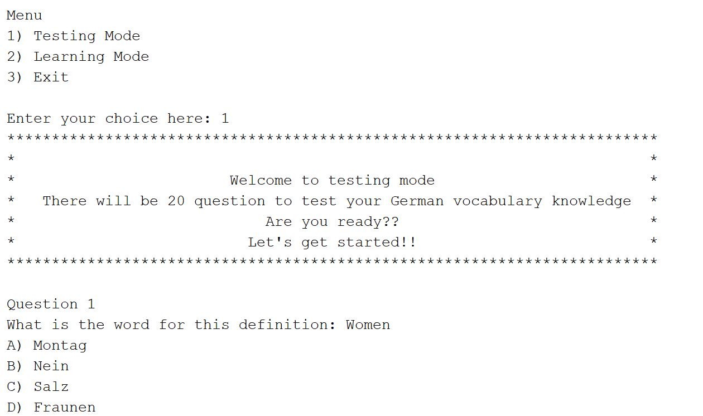
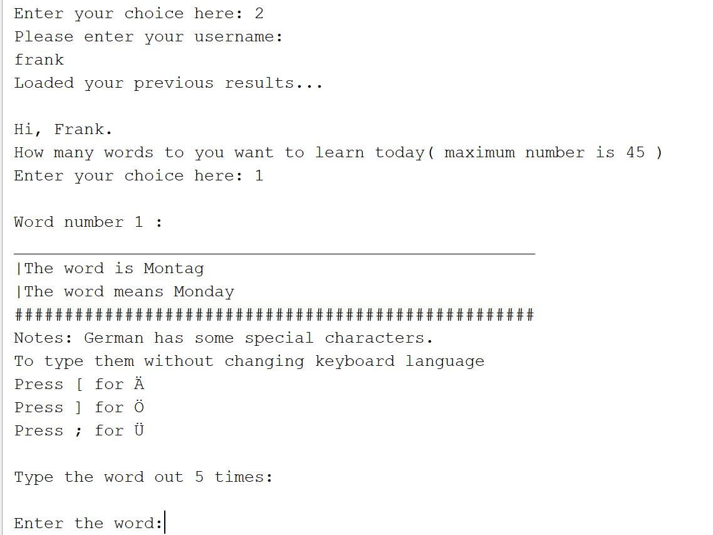

# Learning Vocab

A simple Command line program to learn German. The project is an opportunity for us to get used to Git and Github commit. There are 2 modes in the program. One is learning mode and the other mode is testing mode. 

The project include every file so you can just clone it then open as Netbeans project. This will be easier for any person want to modify the project without having to creating new project then copy the java file in.

## 1. Why using posting it on Github :question:
    * Better collaboration between 2 people
    * Getting used to write git commit message and using Git
    * Putting more comment to explain the code :trollface:

## 2. What is in the testing mode

Each of the testing mode will have a random question based on the word selected. There are two types of question which are multi-choice and  fill in the blank question type

## 3. Screenshot of the program

* Main menu and Start of the testing mode.

* Learning mode in "fancy UI"

Not really advance CLI stuff but this is the learning mode